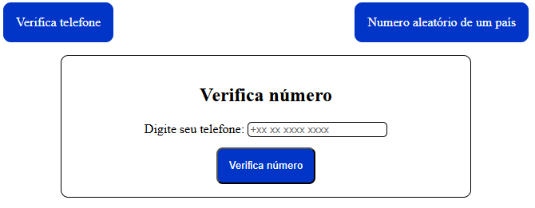

# 07- API REST

> - Caio da Silva Viana

## Trabalho web sobre API

O objetivo é é queutilize uma API pública disponível na internet e crie um Front-End que consuma essa API.

A API escolhida é para a verificação de números de telefone ao redor do mundo.

Essa API é possivel fazer requisições de GET e POST.

> Foi utilizado JS puro para consumir a API.

Esse site funciona da seguinte forma. Na [tela principal](https://veriphone-api.vercel.app/) é possivel fazer uma verificação do seu número de telefone, apenas digitando ele no input e verificando apertando o botão. Na outra página, [Numero aleatório de um país](https://veriphone-api.vercel.app/aleatorio.html) é possivel escolher um país da lista, um tipo de número e solicitar que irá mostrar um número qualquer.
Na tela principal é solicitado via GET e na aleatória é via POST.

---

### Créditos

Tive como referência o material postado na atividade, principalmente o [video de Matheus Battisti](https://www.youtube.com/watch?v=qIGYM4S8x50).

### Licença

Esse código foi criado para o aprendizado e para a atividade da materia de desenvolvimento WEB, sendo disponibilizado para todo e qualquer ato com fim educativo.
A API-key nele utilizada, em determinado momento será desligada/desvinculada.
(c)[Caio da Silva](https://github.com/CaioSilvaCsv) : 2025.
